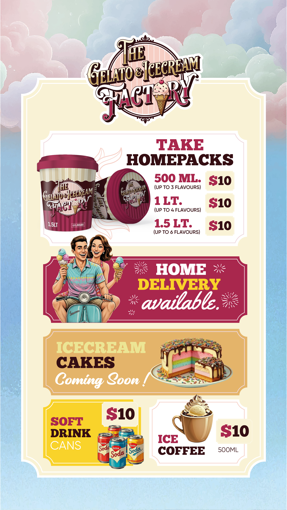

  

<button class="toggle-buttons-btn" id="toggleButtonsBtn">Show/Hide Buttons</button>

Next: 0s

  <a href="index.html">Home</a>
  <a href="5.html">Page 5</a>
  <a href="6.html">Page 6</a>
  <a href="7.html">Page 7</a>
  <a href="8.html">Page 8</a>
  <button id="rotateBtn">Rotate 90°</button>

